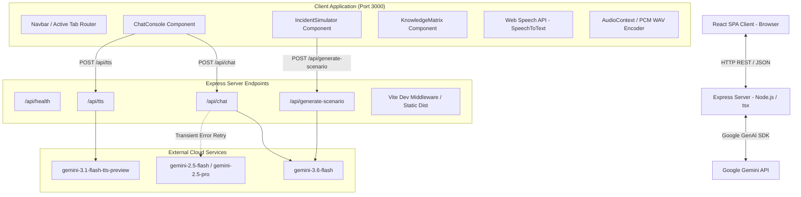
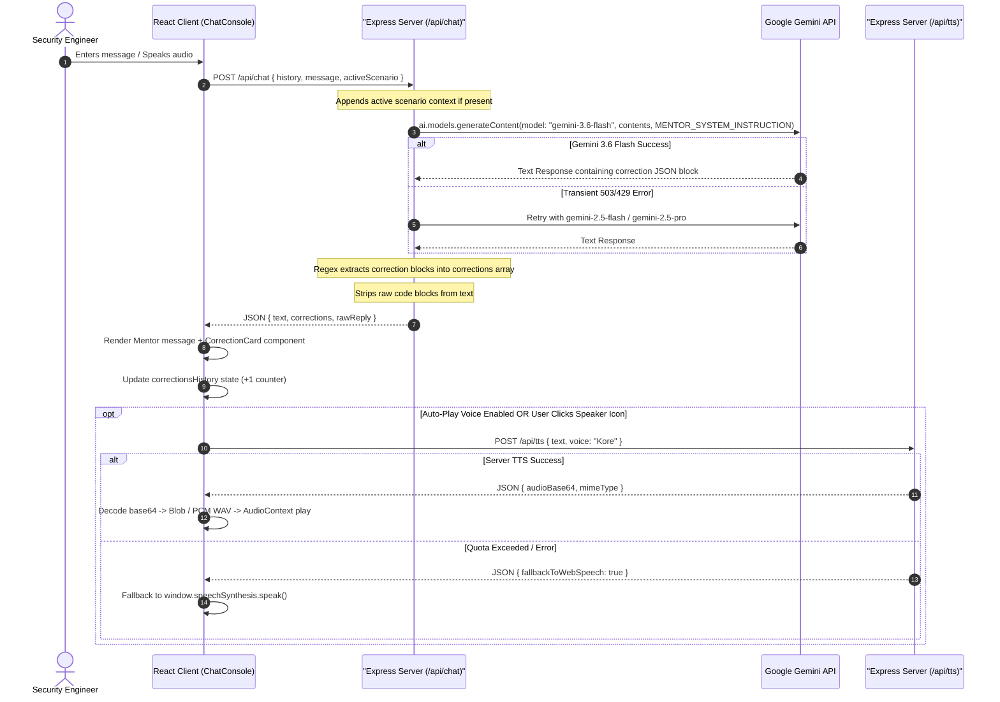
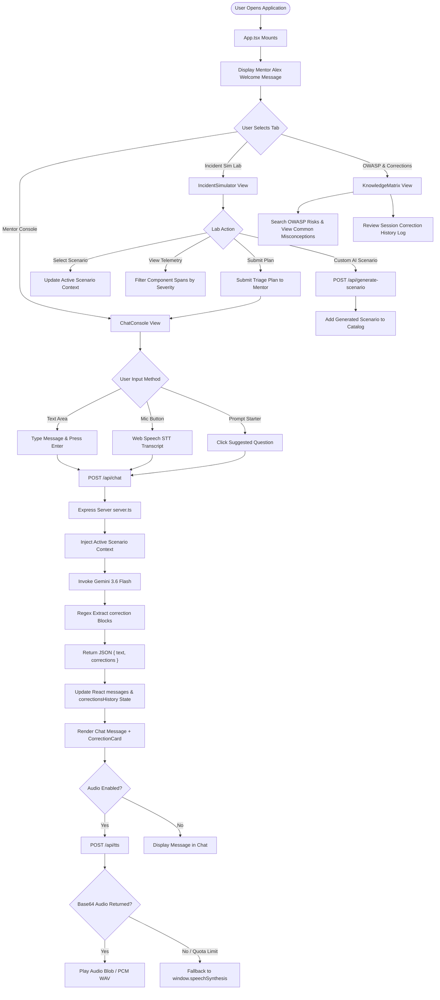

# Agentic AI Security Mentor — Comprehensive Project & System Architecture Documentation

---

## PROJECT OVERVIEW

### Project Name
**Agentic AI Security Mentor** (Internal identifier: `react-example`, AI Studio Applet ID: `f2c41e34-74d2-4257-bef3-f1852a194f95`).

### Purpose
The **Agentic AI Security Mentor** is an interactive, full-stack mentorship and incident simulation platform designed specifically for Security Engineers, SOC Analysts, AI Application Architects, and DevSecOps practitioners. The application accelerates the acquisition of real-world intuition for securing autonomous Large Language Model (LLM) agents, agentic orchestration pipelines, tool calling interfaces, vector store Retrieval-Augmented Generation (RAG) pipelines, and AI system infrastructure.

### High-Level Description
The platform combines a modern React single-page application (SPA) with a Node.js Express server backend powered by Google's Gemini generative AI models (`@google/genai`). It features:
1. **Interactive Mentor Console ("Mentor Alex"):** A conversational interface that evaluates user statements in real-time, detects AI security misconceptions, and outputs structured visual **Correction Cards** detailing the wrong assumption, the accurate security framing, operational risk impact, and category classification.
2. **SOC Incident Simulation Lab:** A security operations center (SOC) console where engineers triage pre-configured or AI-synthesized breach scenarios complete with initial alerts, multi-component span logs, function execution telemetry, architecture diagrams, and technical compromise vectors.
3. **AI Threat Generator:** An on-demand scenario synthesizer using Gemini JSON mode to dynamically generate custom agentic attack simulations (e.g., SSRF via web search agents, inter-agent RPC spoofing, recursive sub-agent DoS).
4. **OWASP Agentic Top 10 Knowledge & Correction Matrix:** A knowledge matrix detailing agentic threat categories (Indirect Prompt Injection, Excessive Agency, Vector Store Poisoning, Flawed AI Incident Containment) along with common engineer misconceptions and required defense controls.
5. **Multi-Modal Voice Interaction Engine:** Speech-to-text recording via browser Web Speech API paired with server-side Text-to-Speech (TTS) generation via `gemini-3.1-flash-tts-preview` and client-side Web Speech Synthesis fallbacks.

### Business Problem Being Solved
Traditional cybersecurity concepts (such as SQL Injection, Cross-Site Scripting, and OS container sandboxing) do not map 1-to-1 to autonomous LLM agent architectures:
- **Misconception 1:** Engineers often assume prompt injection is simply "SQL injection for AI" and try to fix it using input character sanitization (e.g., stripping single quotes or HTML tags), failing to recognize that prompt injection operates on semantic natural language context rather than deterministic compiler syntax.
- **Misconception 2:** Security teams rely on soft system instructions (prompts) to restrict tool access, rather than enforcing hard least-privilege IAM scopes programmatically at the API gateway layer.
- **Misconception 3:** Incident response teams attempt traditional containment (such as restarting an LLM Docker container or retraining model weights), which completely fails to stop compromise because LLM models are stateless, while the true vulnerability lives in persistent tool credentials or poisoned vector databases.
- **Misconception 4:** Security teams assume encrypting a vector store at rest prevents vector poisoning, confusing disk encryption with semantic document provenance validation.

The **Agentic AI Security Mentor** solves this knowledge gap by providing real-time error correction, immediate feedback on triage plans, and realistic telemetry inspection.

### Target Users
- **Agentic AI Security Engineers** designing defenses for multi-agent platforms.
- **SOC Analysts & Incident Responders** triaging alerts from LLM application gateways.
- **AI Application Architects** building RAG pipelines, function calling frameworks, and agent tool execution nodes.
- **DevSecOps Engineers** implementing rate limits, IAM tokens, and human-in-the-loop governance for AI workers.

### Primary Use Cases
1. **Real-Time Conceptual Mentorship:** An engineer explains their prompt injection defense strategy to Mentor Alex, who immediately identifies flaws and issues structured correction cards.
2. **SOC Incident Triage Training:** An analyst inspects raw JSON telemetry spans from a hijacked email support agent, traces the exfiltration attempt through the API gateway, and submits a containment plan for evaluation.
3. **Custom Threat Synthesis:** An architect generates a tailored scenario on a emerging threat vector (e.g., "Autonomous GitHub PR review agent RCE") to test team readiness.
4. **OWASP & Correction Review:** An engineer reviews past mistakes captured in the Session Correction Log to reinforce accurate security terminology and operational containment principles.

### Core Value Proposition
- **Immediate Error Correction:** Unlike static reading material, the mentor actively catches flawed reasoning during natural conversation.
- **Realistic Telemetry Simulation:** Hands-on experience with JSON logs, span traces, and alert structures similar to Datadog, Splunk, or AWS CloudWatch in LLM environments.
- **Dual Text & Voice Interaction:** Fully accessible voice-driven mentorship for hands-free learning.

### SaaS Benefits & Competitive Advantages
| Feature / Aspect | Traditional AI Training | Agentic AI Security Mentor |
| :--- | :--- | :--- |
| **Feedback Loop** | Static quizzes with multiple choice | Real-time conversational parsing with structured JSON correction cards |
| **Telemetry Context** | Theoretical descriptions | Raw, multi-component JSON telemetry logs (AgentOrchestrator, LLMCore, ToolExecutionEngine, VectorStore, APIGateway) |
| **Threat Catalog** | Generic OWASP Top 10 | Specialized OWASP Agentic Top 10 (ASI-01, ASI-02, ASI-03, IR-AGENT-01) |
| **Adaptability** | Hardcoded text scenarios | On-demand AI scenario generation via Gemini JSON mode |
| **Containment Practice** | Abstract discussion | Hands-on triage submission with mentor evaluation of execution order |

### Major Capabilities
Declared in `metadata.json`:
- `MAJOR_CAPABILITY_SERVER_SIDE_GEMINI_API`: Server-side Gemini API integration via Node.js Express proxy.
- Microphones frame permission requested (`"requestFramePermissions": ["microphone"]`).

---

## WHAT IS AGENTIC AI

### Definition of Agentic AI
**Agentic AI** refers to autonomous software systems driven by Large Language Models (LLMs) that do not merely generate text, but actively perceive their environment, decompose complex goals into sequential sub-tasks, execute function calls (tools), inspect execution outputs, maintain short/long-term memory, and loop iteratively until a objective is achieved.

```
                  +-----------------------------------+
                  |        User Goal / Trigger        |
                  +-----------------+-----------------+
                                    |
                                    v
                  +-----------------+-----------------+
                  |      Agent Core (LLM Engine)      |
                  +-----------------+-----------------+
                                    |
            +-----------------------+-----------------------+
            |                       |                       |
            v                       v                       v
  +-------------------+   +-------------------+   +-------------------+
  |     Planning      |   |   Memory System   |   |   Tool Execution  |
  | (Sub-task Breakdown) | | (Context / Vector) |  | (APIs/DB/Shell)   |
  +-------------------+   +-------------------+   +-------------------+
            ^                       ^                       |
            |                       |                       |
            +-----------------------+-----------------------+
                            Observation Loop
```

### Key Differences: AI Chatbots vs. AI Agents

| Dimension | Standard AI Chatbot | Autonomous AI Agent |
| :--- | :--- | :--- |
| **Execution Loop** | Single turn (Prompt -> Response) | Multi-step reasoning loop (Observe -> Plan -> Act -> Evaluate) |
| **Tool Usage** | None or simple read-only retrieval | Active function calling (Database queries, shell execution, IAM updates, API calls) |
| **Autonomy** | Passive text generator | Active decision maker with degree of delegated authority |
| **State & Memory** | Chat session history | Context window, working memory, vector databases, external stores |
| **Security Risk Profile** | Harmful text outputs, hallucination | Unintended side effects, data exfiltration, unauthorized API operations, resource exhaustion |

### Core Components of Agentic Systems
1. **Autonomous Reasoning & Planning:** The agent uses chain-of-thought, ReAct (Reasoning + Acting), or Plan-and-Solve strategies to break high-level directives into discrete tool calls.
2. **Tool Usage (Function Calling):** The agent converts natural language intents into structured JSON function parameters executed by client or server runners.
3. **Memory Systems:**
   - *Short-Term Memory:* Active context window containing system prompt, task history, and tool outputs.
   - *Long-Term Memory:* External vector databases (e.g., `pgvector`) retrieved via semantic similarity search (RAG).
4. **Multi-Step Execution & Sub-agent Delegation:** Master agents spwan specialized sub-agents to solve parallel sub-problems.
5. **Human-in-the-Loop (HITL):** Governance checkpoints requiring human approval before executing sensitive or irreversible actions.

### Implementation in THIS Project
This project operationalizes Agentic AI concepts in two ways:
1. **Educational Domain Model:** The platform simulates agentic threats (Indirect Prompt Injection, Excessive Agency, RAG Poisoning, Unbounded Recursion) through telemetry logs and architecture workflows.
2. **Application Architecture:** The platform's backend acts as an Agentic Mentor Engine (`server.ts`), utilizing `gemini-3.6-flash` with a tailored system instruction (`MENTOR_SYSTEM_INSTRUCTION`). The mentor agent dynamically parses user input, extracts structured correction JSON blocks (` ```correction ... ``` `), maintains chat context, and controls voice generation.

---

## PROJECT ARCHITECTURE

### High-Level Architecture
The application follows a full-stack client-server architecture running inside a Cloud Run container environment:



### Component Architecture & Interactions

```
+-----------------------------------------------------------------------------------+
|                                  BROWSER CLIENT                                   |
|                                                                                   |
|  +-----------------------------------------------------------------------------+  |
|  |                            Navbar Component                                 |  |
|  |  - Tab Switcher (Console | Sim Lab | OWASP Matrix)                           |  |
|  |  - Audio Toggle (Voice ON/OFF)                                              |  |
|  |  - Real-time Session Corrections Counter Badge                              |  |
|  +-----------------------------------------------------------------------------+  |
|                                                                                   |
|  +-----------------------+  +-----------------------+  +-----------------------+  |
|  |      ChatConsole      |  |   IncidentSimulator   |  |    KnowledgeMatrix    |  |
|  |                       |  |                       |  |                       |  |
|  | - Message Transcript  |  | - Scenario Catalog    |  | - OWASP Top Risks     |  |
|  | - Correction Cards    |  | - Telemetry Viewer    |  | - Common Misconcepts  |  |
|  | - Prompt Starters     |  | - Compromise Vector   |  | - Mitigation List     |  |
|  | - Mic Recording (STT) |  | - Triage Submission   |  | - Session Correction  |  |
|  | - Textarea Input      |  | - Custom Scenario AI  |  |   History Log         |  |
|  +-----------+-----------+  +-----------+-----------+  +-----------+-----------+  |
|              |                      |                              |              |
+--------------|----------------------|------------------------------|--------------+
               |                      |                              |
               v                      v                              v
+-----------------------------------------------------------------------------------+
|                             EXPRESS SERVER (server.ts)                            |
|                                                                                   |
|  +------------------+  +------------------------+  +---------------------------+  |
|  | POST /api/chat   |  | POST /api/generate-... |  | POST /api/tts             |  |
|  |                  |  |                        |  |                           |  |
|  | - Scenario Context| | - JSON Mode Prompt     |  | - Text sanitization       |  |
|  | - Retry Failover |  | - gemini-3.6-flash     |  | - gemini-3.1-flash-tts    |  |
|  | - Correction     |  | - Schema validation    |  | - Fallback indicator      |  |
|  |   Regex Parse    |  |                        |  |   on quota limits         |  |
|  +--------+---------+  +-----------+------------+  +-------------+-------------+  |
|           |                        |                             |                |
+-----------|------------------------|-----------------------------|----------------+
            |                        |                             |
            v                        v                             v
+-----------------------------------------------------------------------------------+
|                             GOOGLE GEMINI API SERVICES                            |
|                                                                                   |
|   [gemini-3.6-flash]            [gemini-2.5-flash/pro]   [gemini-3.1-flash-tts]  |
+-----------------------------------------------------------------------------------+
```

### Message Sequence Diagram: User Interaction & Correction Flow



---

## DIRECTORY WALKTHROUGH

```
/
├── .env.example              # Environment variable declaration template
├── .gitignore                # Git exclusion rules
├── bun.lock                  # Lockfile for Bun package manager
├── index.html                # HTML entry point for Vite SPA
├── metadata.json             # AI Studio applet manifest (permissions, capabilities)
├── package.json              # Dependencies, build & start scripts
├── server.ts                 # Full-stack Express server & Gemini API proxy
├── tsconfig.json             # TypeScript compiler configuration
├── vite.config.ts            # Vite bundler configuration with Tailwind CSS plugin
├── assets/                   # Static media directory
└── src/                      # Frontend React application source
    ├── App.tsx               # Root component, state owner & layout container
    ├── index.css             # Tailwind CSS global entry directive
    ├── main.tsx              # React DOM root mounting script
    ├── types.ts              # Global TypeScript interfaces & severity enums
    ├── components/           # UI Component hierarchy
    │   ├── ChatConsole.tsx       # Conversational mentor interface with voice & starters
    │   ├── CorrectionCard.tsx    # Structured card for misconception display
    │   ├── IncidentSimulator.tsx # SOC lab, log viewer, & AI threat generator
    │   ├── KnowledgeMatrix.tsx   # OWASP Agentic Top 10 matrix & session log
    │   └── Navbar.tsx            # Sticky header, tab switcher, voice toggle
    └── data/                 # Static datasets
        ├── knowledgeBase.ts  # OWASP Agentic Top 10 risks & misconceptions
        └── scenarios.ts      # Pre-built incident scenario catalog with telemetry
```

### Directory Details

#### `/ (Root)`
- **Purpose:** Environment, configuration, build tooling, and server entry point.
- **Responsibilities:** Manages dependencies (`package.json`), defines app capabilities (`metadata.json`), configures Vite/TypeScript (`vite.config.ts`, `tsconfig.json`), and boots the full-stack server (`server.ts`).

#### `/src`
- **Purpose:** React 19 client application.
- **Responsibilities:** Renders single-page application UI, manages state (`App.tsx`), handles component modularity, defines domain types (`types.ts`).

#### `/src/components`
- **Purpose:** Modular UI components.
- **Responsibilities:**
  - `Navbar.tsx`: Displays brand, online status, tab navigation, voice toggle, and corrections counter.
  - `ChatConsole.tsx`: Main chat interface, speech recognition controls, audio speaker buttons, prompt starters.
  - `CorrectionCard.tsx`: Highlights user misconceptions with color-coded severity badges.
  - `IncidentSimulator.tsx`: Renders SOC incident catalog, telemetry log viewer with severity filters, architecture descriptions, triage plan form, and AI scenario generator form.
  - `KnowledgeMatrix.tsx`: Detailed view of OWASP Agentic risks, misconceptions, defense controls, and session correction log.

#### `/src/data`
- **Purpose:** Initial static domain data.
- **Responsibilities:**
  - `knowledgeBase.ts`: Standardized OWASP Agentic Top 10 data structure (`ASI-01`, `ASI-02`, `ASI-03`, `IR-AGENT-01`).
  - `scenarios.ts`: Initial breach scenarios containing simulated JSON telemetry logs.

---

## FILE WALKTHROUGH

### 1. Root Configuration & Server Files

#### `package.json`
- **Purpose:** Project metadata, scripts, and dependency definitions.
- **Scripts:**
  - `"dev": "tsx server.ts"`: Starts dev server with `tsx` TypeScript executor.
  - `"build": "vite build && esbuild server.ts --bundle --platform=node --format=cjs --packages=external --sourcemap --outfile=dist/server.cjs"`: Bundles Vite frontend assets into `dist/` and compiles `server.ts` into a CommonJS server file (`dist/server.cjs`).
  - `"start": "node dist/server.cjs"`: Runs production server.
  - `"lint": "tsc --noEmit"`: Type checks codebase.
- **Core Dependencies:** `@google/genai` (^2.4.0), `express` (^4.21.2), `react` (^19.0.1), `react-dom` (^19.0.1), `vite` (^6.2.3), `lucide-react` (^0.546.0), `motion` (^12.23.24), `dotenv` (^17.2.3), `@tailwindcss/vite` (^4.1.14).

#### `metadata.json`
- **Purpose:** Application manifest for Google AI Studio environment.
- **Contents:** Name (`"Agentic AI Security Mentor"`), description, permissions (`["microphone"]`), and major capabilities (`["MAJOR_CAPABILITY_SERVER_SIDE_GEMINI_API"]`).

#### `.env.example`
- **Purpose:** Documents environment variables required at runtime.
- **Variables:**
  - `GEMINI_API_KEY`: API key for Google Gemini model calls (server-side only).
  - `APP_URL`: Cloud Run hosting URL injected by platform.

#### `server.ts`
- **Purpose:** Full-stack Express 4 application server and API proxy.
- **Key Exports / Functions:**
  - `getGeminiClient()`: Instantiates `GoogleGenAI` client using `process.env.GEMINI_API_KEY` with a telemetry header (`User-Agent: aistudio-build`).
  - `MENTOR_SYSTEM_INSTRUCTION`: Multi-line prompt defining Mentor Alex's identity, tone, correction rules, and JSON formatting requirements (` ```correction ... ``` `).
  - `generateContentWithRetry()`: Helper implementing failover retry logic across `gemini-3.6-flash`, `gemini-2.5-flash`, and `gemini-2.5-pro`.
  - `POST /api/chat`: Accepts conversation history, message text, and optional active scenario context. Invokes Gemini, extracts embedded correction JSON blocks via regex, strips code block formatting, and returns clean text + corrections array.
  - `POST /api/tts`: Sanitizes text input, invokes `gemini-3.1-flash-tts-preview` with requested voice (`Kore`), and returns base64 audio and MIME type. Automatically signals `{ fallbackToWebSpeech: true }` if free-tier quota is exceeded.
  - `POST /api/generate-scenario`: Takes a custom topic, invokes `gemini-3.6-flash` in JSON mode (`responseMimeType: "application/json"`), and returns a validated `IncidentScenario` schema.
  - `startServer()`: Binds Express to port 3000 (`0.0.0.0`) and mounts Vite dev middleware in development or static `dist/` serving in production.

#### `vite.config.ts`
- **Purpose:** Vite bundler configuration.
- **Features:** Integrates `@tailwindcss/vite` plugin and `@vitejs/plugin-react`. Configures alias `@` pointing to project root. Handles `DISABLE_HMR` environment variable.

#### `tsconfig.json`
- **Purpose:** TypeScript compiler options (`ES2022`, `ESNext` modules, `bundler` resolution, `react-jsx` transform).

---

### 2. Frontend Core Files (`/src`)

#### `src/types.ts`
- **Purpose:** Global TypeScript interfaces and type definitions.
- **Key Types:**
  - `SeverityLevel`: `'low' | 'medium' | 'high' | 'critical'`.
  - `CorrectionItem`: Interface for structured misconception corrections (`id`, `userQuote`, `correctedConcept`, `explanation`, `category`, `operationalImpact`, `timestamp`).
  - `ChatMessage`: Chat transcript entry (`id`, `sender`, `text`, `timestamp`, `corrections`, `scenarioId`, `audioBase64`, `isStreaming`).
  - `TelemetryLog`: Simulated log span (`timestamp`, `component`, `level`, `event`, `details`).
  - `IncidentScenario`: Security scenario definition (`id`, `title`, `category`, `difficulty`, `summary`, `architectureDescription`, `compromiseVector`, `affectedComponents`, `telemetryLogs`, `initialAlert`, `sampleSolutionSteps`, `guidedQuestions`).
  - `UserStats`: Domain tracking stats (`totalMessages`, `correctionsCount`, `scenariosCompleted`, `domainMastery`).

#### `src/data/knowledgeBase.ts`
- **Purpose:** Static repository of OWASP Agentic Top 10 risks.
- **Contents:**
  - `ASI-01 / LLM01`: Indirect Prompt Injection & Context Hijacking.
  - `ASI-02 / LLM08`: Excessive Agency & Uncontrolled Tool Execution.
  - `ASI-03 / LLM03`: RAG Pipeline & Vector Store Poisoning.
  - `IR-AGENT-01`: Flawed AI Incident Response & Containment.

#### `src/data/scenarios.ts`
- **Purpose:** Pre-packaged breach scenarios for the Incident Simulation Lab.
- **Scenarios:**
  1. `indirect-prompt-injection-agent-hijack`: SupportBot-v4 email agent database exfiltration attack.
  2. `rag-vector-poisoning-data-leak`: HR Assistant RAG vector store document poisoning leading to unauthorized IAM admin privilege grant.
  3. `unbounded-agent-orchestration-dos`: DevOpsAssistant multi-agent recursive sub-agent explosion causing API rate limit exhaustion and Denial of Wallet.

#### `src/App.tsx`
- **Purpose:** Top-level application container and central state manager.
- **State Properties:**
  - `activeTab`: `'chat' | 'lab' | 'knowledge'`.
  - `autoPlayAudio`: `boolean` (controls automatic voice output).
  - `messages`: `ChatMessage[]` (conversation transcript).
  - `correctionsHistory`: `CorrectionItem[]` (all logged corrections in session).
  - `isLoading`: `boolean` (API loading state).
  - `activeScenario`: `IncidentScenario | null` (currently selected simulation scenario).
  - `playingAudioMsgId`: `string | null` (currently playing message ID).
  - `isGeneratingScenario`: `boolean` (AI generator loading state).
- **Key Functions:**
  - `handleSendMessage(text)`: Posts query to `/api/chat`, appends mentor response, logs extracted corrections, and triggers TTS if enabled.
  - `handlePlayTTS(text, msgId)`: Calls `/api/tts`. Decodes base64 audio, attempts `playAudioBase64()`, and falls back to `playWithWebSpeech()` on quota limits.
  - `playAudioBase64(base64Data, mimeType)`: Converts base64 to byte array, creates Blob URL, and plays audio.
  - `playPcmWithAudioContext(bytes)`: Fallback for headerless PCM audio that wraps raw PCM in a 44-byte WAV header (`pcmToWav()`) and plays via Web Audio API `AudioContext`.
  - `handleSelectScenario(scenario)`: Updates active incident context and notifies chat.
  - `handleSubmitTriagePlan(plan)`: Switches to chat tab and sends plan for mentor review.
  - `handleGenerateCustomScenario(topic)`: Calls `/api/generate-scenario` and inserts result into scenario catalog.

#### `src/components/Navbar.tsx`
- **Purpose:** Navigation header.
- **Features:** Shows logo, mentor online indicator (`Radio` pulse icon), tab selection buttons (`Mentor Console`, `Incident Simulation Lab`, `OWASP & Corrections`), audio toggle button (`Voice ON` / `Voice Muted`), and real-time corrections counter badge. Responsive mobile bottom bar.

#### `src/components/ChatConsole.tsx`
- **Purpose:** Main conversational mentor view.
- **Features:** Displays active incident banner, prompt starter chips (`PROMPT_STARTERS`), chat message list, speech recognition mic toggle button (Web Speech API), speech error alert banner, and textarea prompt submission form. Handles Enter key send.

#### `src/components/CorrectionCard.tsx`
- **Purpose:** Renders structured misconception corrections.
- **Design:** Styled with amber border, gradient header line, category title, operational impact severity badge (`critical`, `high`, `medium`, `low`), quote block of user error, corrected concept box, and operational explanation ("Why This Matters").

#### `src/components/IncidentSimulator.tsx`
- **Purpose:** SOC simulation console.
- **Layout:**
  - *Left Sidebar:* SOC Incident Catalog list and AI Threat Generator input form.
  - *Main Panel:* Alert banner, tabbed view switcher (`Raw Telemetry & Model Logs`, `Architecture & Compromise Flow`, `Triage & Containment Plan`).
  - *Telemetry View:* Level filter buttons (`ALL`, `SECURITY_ALERT`, `ERROR`, `WARN`, `INFO`), timestamped component spans, JSON details inspector.
  - *Workspace View:* Triage plan textarea submission form and mentor solution checklist accordion.

#### `src/components/KnowledgeMatrix.tsx`
- **Purpose:** Educational matrix and session log viewer.
- **Features:** Searchable OWASP Agentic Top 10 risks list, detailed topic view with wrong assumptions vs. accurate framings, required defense controls, and complete history log of all corrections triggered during the active session.

---

## APPLICATION FLOW



---

## AGENT SYSTEM

### 1. Mentor Alex Agent
- **Purpose:** Acts as a senior Agentic AI Security Engineering mentor.
- **Identity & System Instructions (`MENTOR_SYSTEM_INSTRUCTION`):** Defined in `server.ts`. Employs a calm, firm, non-judgmental tone.
- **Correction Protocol:** When user messages contain incorrect AI security terminology, wrong vulnerability/defense assumptions, or flawed incident containment logic, Mentor Alex:
  1. Emits a structured JSON block wrapped in ` ```correction ... ``` ` tags.
  2. Quotes the user's incorrect phrase in spoken conversational text.
  3. Provides the accurate framing.
  4. Explains the operational risk in 1–3 sentences.
  5. Asks a constructive follow-up mentor question.

```json
{
  "userQuote": "Prompt injection is just a fancy word for SQL injection",
  "correctedConcept": "Prompt injection manipulates non-deterministic model context logic",
  "explanation": "Prepared statements completely neutralize SQL injection by separating code from data. Models process all context as token representations.",
  "category": "Terminology",
  "operationalImpact": "high"
}
```

### 2. AI Threat Generator Agent
- **Purpose:** Synthesizes custom breach scenarios on demand.
- **Model:** `gemini-3.6-flash` with `responseMimeType: "application/json"`.
- **Outputs:** Fully populated `IncidentScenario` object including title, category, initial alert details, component telemetry spans, compromise vector, and guided questions.

### 3. Simulated Application Target Agents (In Scenarios)
- **`SupportBot-v4`:** Autonomous email processing agent compromised via indirect prompt injection in email body context.
- **`HRAssistant`:** Internal RAG search agent hijacked via poisoned vector store PDF chunks.
- **`DevOpsAssistant`:** Master orchestrator agent suffering unbounded sub-agent recursion loops.

---

## REASONING PIPELINE

```
+-----------------------------------------------------------------------------------+
|                            SERVER REASONING PIPELINE                              |
+-----------------------------------------------------------------------------------+
  1. Context Assembly
     ├── Extract `history` array from request body
     ├── Format existing messages into Gemini `contents` array ({ role, parts })
     └── If `activeScenario` exists, prepends active incident scenario summary,
         architecture, compromise vector, and alert JSON to user prompt

  2. Model Execution & Failover Loop (`generateContentWithRetry`)
     ├── Primary Attempt: `gemini-3.6-flash` (Attempt 1 -> 1s delay on transient error -> Attempt 2)
     ├── Secondary Failover: `gemini-2.5-flash`
     └── Tertiary Failover: `gemini-2.5-pro`

  3. Response Parsing & Parsing Engine
     ├── Receive raw model output text
     ├── Execute Regex Matcher: `/```correction\s*([\s\S]*?)\s*```/g`
     ├── Safely `JSON.parse()` extracted match strings into `CorrectionItem` array
     └── Strip raw ` ```correction ``` ` blocks from text to produce clean conversational text

  4. Client State Reconciliation
     ├── Append mentor response message to React `messages` state
     ├── Prepend extracted corrections to `correctionsHistory` state
     └── Trigger UI re-render of ChatConsole + CorrectionCard components
```

---

## MEMORY SYSTEM

| Memory Type | Implementation Mechanism | Duration / Lifetime | Scope |
| :--- | :--- | :--- | :--- |
| **Short-Term Context Window** | `messages` array in React `App.tsx` state passed to `/api/chat` as `history` | Current browser session | Active conversation thread |
| **Active Scenario Context** | `activeScenario` state injected as system prefix in `/api/chat` payload | Until scenario switched | Chat & Simulation Lab |
| **Session Correction Log** | `correctionsHistory` React state array | Current browser session | Knowledge Matrix & Navbar counter |
| **Scenario Catalog Memory** | In-memory `INCIDENT_SCENARIOS` array in `scenarios.ts` (dynamically unshifted) | Current runtime session | Incident Simulator |

*Note: The application intentionally uses transient client-side React memory. There is no external persistent database or vector store required for the applet runtime.*

---

## TOOLS

### Available Runtime & API Tools

| Tool / Mechanism | Location | Purpose | Inputs | Outputs |
| :--- | :--- | :--- | :--- | :--- |
| **Web Speech Recognition** | `ChatConsole.tsx` | Voice-to-text transcript input | Microphone audio stream | Text string populated in textarea |
| **Gemini TTS API** | `server.ts` (`/api/tts`) | Neural voice synthesis | Text string, voice name (`Kore`) | Base64 audio + MIME type (`audio/mp3`) |
| **Web Speech Synthesis Fallback** | `App.tsx` (`playWithWebSpeech`) | Client-side TTS on quota limits | Text string | Browser voice speech audio |
| **PCM WAV Converter** | `App.tsx` (`pcmToWav`) | Converts headerless PCM to WAV | Raw `Uint8Array` PCM bytes | 44-byte WAV header + PCM buffer |
| **AI Threat Generator** | `server.ts` (`/api/generate-scenario`) | Generates custom breach scenarios | Topic string | Validated `IncidentScenario` JSON |
| **Model Failover Retry** | `server.ts` (`generateContentWithRetry`) | Automatic API error resilience | Contents, system instruction | Gemini response object |

---

## DATABASE

**Current Implementation Status:**
Not applicable / None. The application operates entirely as a stateless client-server applet. Application data is held in client memory (`useState`), pre-populated from static TypeScript modules (`knowledgeBase.ts`, `scenarios.ts`), or fetched dynamically from Gemini API endpoints.

---

## API DOCUMENTATION

### 1. GET `/api/health`
- **Purpose:** Service health check and uptime verification.
- **Authentication:** None.
- **Response:**
  ```json
  {
    "status": "ok",
    "time": "2026-07-22T08:32:29.123Z"
  }
  ```

### 2. POST `/api/chat`
- **Purpose:** Primary chat endpoint with Mentor Alex.
- **Request Body:**
  ```json
  {
    "history": [
      { "sender": "user", "text": "Hello Mentor Alex" },
      { "sender": "mentor", "text": "Greetings! What security topic shall we cover?" }
    ],
    "message": "We prevent prompt injection by sanitizing quotes in user input.",
    "activeScenario": { ... } // Optional IncidentScenario object
  }
  ```
- **Response:**
  ```json
  {
    "text": "Sanitizing single quotes or special characters does not prevent prompt injection...",
    "corrections": [
      {
        "id": "corr-1721637123-x82a1",
        "userQuote": "sanitizing quotes in user input",
        "correctedConcept": "Prompt injection operates on semantic natural language instructions",
        "explanation": "Prompt injection does not rely on special syntax characters like single quotes or angle brackets.",
        "category": "Vulnerability/Defense",
        "operationalImpact": "high",
        "timestamp": "2026-07-22T08:32:29.123Z"
      }
    ],
    "rawReply": "..."
  }
  ```

### 3. POST `/api/tts`
- **Purpose:** Generates Text-to-Speech audio.
- **Request Body:**
  ```json
  {
    "text": "Greetings Engineer, welcome to the SOC simulator.",
    "voice": "Kore"
  }
  ```
- **Success Response:**
  ```json
  {
    "audioBase64": "//uQxAAAAAAAAAAAAAAAAAAAA...",
    "mimeType": "audio/mp3"
  }
  ```
- **Fallback Response (on quota limit or error):**
  ```json
  {
    "fallbackToWebSpeech": true
  }
  ```

### 4. POST `/api/generate-scenario`
- **Purpose:** Synthesizes a new custom incident scenario.
- **Request Body:**
  ```json
  {
    "topic": "Autonomous GitHub PR review agent RCE"
  }
  ```
- **Response:**
  ```json
  {
    "id": "generated-scenario-1721637123999",
    "title": "Remote Code Execution via Malicious PR Payload",
    "category": "Tool Execution & Code Review Security",
    "difficulty": "Advanced",
    "summary": "An attacker submitted a pull request containing embedded command injection instructions...",
    "architectureDescription": "GitHub Webhook -> Review Agent -> Containerized Executor",
    "compromiseVector": "Command injection via un-sanitized string template interpolation in bash tool",
    "affectedComponents": ["PR Parser", "Review Agent Core", "Bash Execution Tool"],
    "initialAlert": { ... },
    "telemetryLogs": [ ... ],
    "sampleSolutionSteps": [ ... ],
    "guidedQuestions": [ ... ]
  }
  ```

---

## FRONTEND ARCHITECTURE

- **Framework:** React 19 with Vite 6.
- **Styling:** Tailwind CSS v4 using `@import "tailwindcss";` directive in `index.css`.
- **Iconography:** `lucide-react` icons exclusively.
- **Component Hierarchy:**
  - `App.tsx` (Root state owner, tab routing, TTS player, audio context)
    - `Navbar.tsx` (Top navigation, voice toggle, corrections counter)
    - `ChatConsole.tsx` (Chat transcript, STT mic recording, prompt starters)
      - `CorrectionCard.tsx` (Embedded misconception cards)
    - `IncidentSimulator.tsx` (SOC catalog, telemetry log viewer, triage form, AI threat generator)
    - `KnowledgeMatrix.tsx` (OWASP risk matrix, search input, session history log)

---

## BACKEND ARCHITECTURE

- **Framework:** Express 4 on Node.js / `tsx`.
- **Build Target:** Bundled CommonJS via `esbuild` (`dist/server.cjs`).
- **Server Entry:** `server.ts` listening on `0.0.0.0:3000`.
- **Middleware:** `express.json({ limit: "10mb" })`, Vite middleware in dev, static file serving in production.
- **AI SDK:** `@google/genai` (^2.4.0) with `GoogleGenAI` class.

---

## AUTHENTICATION

- **Status:** Unauthenticated.
- **Design Context:** Designed as an open educational applet inside the AI Studio sandboxed container. User session identity is client-local.

---

## CONFIGURATION

| Environment Variable | Required | Source | Purpose |
| :--- | :--- | :--- | :--- |
| `GEMINI_API_KEY` | Yes | AI Studio Secrets / `.env` | Authorizes `@google/genai` requests to Gemini endpoints |
| `APP_URL` | No | Platform Cloud Run | Self-referential URL for service hosting |
| `NODE_ENV` | No | System Environment | Toggles between Vite middleware (`development`) and static `dist` (`production`) |
| `DISABLE_HMR` | No | AI Studio Platform | Set to `true` to disable Vite HMR during agent edit turns |

---

## INSTALLATION & LOCAL DEVELOPMENT

### Prerequisites
- Node.js >= 18.0.0 or Bun.
- Google Gemini API key (`GEMINI_API_KEY`).

### Local Setup Steps
1. Clone repository into local environment.
2. Create `.env` file from template:
   ```bash
   cp .env.example .env
   ```
3. Edit `.env` and insert your API key:
   ```env
   GEMINI_API_KEY="your-actual-gemini-api-key"
   ```
4. Install dependencies:
   ```bash
   npm install
   ```
5. Launch development server:
   ```bash
   npm run dev
   ```
6. Access application in browser at `http://localhost:3000`.

### Production Build & Launch
```bash
# Compile Vite frontend and esbuild server.ts bundle
npm run build

# Start production server
npm run start
```

---

## HOW TO USE THE SAAS: USER GUIDE

### 1. Mentor Console Tab
- **Start a Conversation:** Ask a question in the prompt box or click one of the suggested prompt starters.
- **Speak Your Response:** Click the microphone icon button to dictate your prompt via browser speech recognition.
- **Review Corrections:** If your message contains a misconception, Mentor Alex will generate an amber-bordered **Correction Card** explaining the exact user quote, the corrected concept, and operational impact.
- **Audio Output:** Click the speaker button on any mentor message to hear the response aloud. Toggle "Voice ON" in the header to auto-play mentor responses.

### 2. Incident Simulation Lab Tab
- **Select an Incident:** Choose a scenario from the SOC Incident Catalog (e.g., SupportBot Email Agent Hijack).
- **Inspect Telemetry:** Click "Raw Telemetry & Model Logs" to inspect timestamped component spans (`AgentOrchestrator`, `LLMCore`, `ToolExecutionEngine`, `APIGateway`). Filter logs by level (`SECURITY_ALERT`, `ERROR`, `WARN`, `INFO`).
- **Review Architecture:** Click "Architecture & Compromise Flow" to study the target system pipeline and technical breach vector.
- **Submit Triage Plan:** Click "Triage & Containment Plan", write your step-by-step response, and submit it directly to Mentor Alex for evaluation.
- **Synthesize New Threat:** Enter a custom topic (e.g., "Web search agent SSRF") in the AI Threat Generator box and click "Generate AI Threat Scenario".

### 3. OWASP & Corrections Matrix Tab
- **Explore OWASP Top Risks:** Click any OWASP Agentic Top Risk to view description, wrong statements vs. accurate framings, and required defense controls.
- **Review Correction History:** Click "Session Correction Log" to review all real-time corrections triggered during your session.

---

## HOW THE AGENTS WORK: TECHNICAL IN-DEPTH

### 1. Dual Structured & Conversational Output System
Rather than forcing Gemini to respond exclusively in raw JSON (which ruins natural text conversation) or raw markdown text (which breaks structured UI rendering), `server.ts` implements a hybrid parsing system:
- The system instruction commands the model to output a custom markdown code block:
  ```
  ```correction
  {
    "userQuote": "...",
    "correctedConcept": "...",
    "explanation": "...",
    "category": "...",
    "operationalImpact": "..."
  }
  ```
  ```
- The backend uses regex (`/```correction\s*([\s\S]*?)\s*```/g`) to strip this block before sending clean text to the UI, while sending the parsed JSON as a typed `corrections` array.

### 2. Audio Failover Pipeline
```
[TTS Request] ---> Express Server (/api/tts)
                         |
                         v
              [gemini-3.1-flash-tts-preview]
                         |
           +-------------+-------------+
           |                           |
    (Success Base64)            (Quota Limit / 429)
           |                           |
           v                           v
   Client Blob Playback       Signal { fallbackToWebSpeech }
           |                           |
   (Headerless PCM?)                   v
           |                 window.speechSynthesis
           v
   [pcmToWav] WAV Header 
   + Web Audio AudioContext
```

---

## SECURITY CONSIDERATIONS

1. **Server-Side API Key Isolation:** The `GEMINI_API_KEY` is kept strictly server-side in `server.ts` and `.env`. No API keys are exposed to client JavaScript bundles or browser DevTools.
2. **Input Sanitization:** Text payloads sent to TTS endpoints are stripped of markdown characters (`*#_```) and URL strings, and truncated to 800 characters to prevent buffer bloat.
3. **Regex Boundary Isolation:** Embedded JSON correction extraction uses strict boundary matching to prevent prompt injection inside user messages from spoofing correction cards.

---

## PERFORMANCE & OPTIMIZATION

- **Model Failover Chain:** Prevents user request drops during Gemini API spikes by retrying across fallback models (`gemini-3.6-flash` -> `gemini-2.5-flash` -> `gemini-2.5-pro`).
- **Memory Cleanup:** Audio Blob object URLs created during voice playback are revoked immediately upon track termination (`URL.revokeObjectURL(url)`) to prevent memory leaks in long sessions.
- **Tailwind v4 Integration:** Bundled via `@tailwindcss/vite` for instantaneous CSS utility generation.

---

## ERROR HANDLING

- **API Failures:** Backend API routes wrap handlers in `try...catch` blocks and return standard `{ error: "message" }` JSON responses with HTTP 400/500 status codes.
- **Client Fallbacks:** If the chat endpoint fails, a system message badge appears in the transcript with details. If server TTS reaches quota limits, client Web Speech Synthesis handles audio silently.
- **Speech Recognition Shielding:** Microphone permission errors (e.g., iframe permissions blocked) are caught and displayed as dismissible amber warning banners.

---

## DEPENDENCIES DOCUMENTATION

### Production Dependencies
- `@google/genai`: Official Google GenAI SDK for Gemini models.
- `express`: Node.js web framework for API routing and static file serving.
- `react` & `react-dom`: UI rendering engine (React 19).
- `lucide-react`: SVG icon library.
- `motion`: Animation library for smooth UI transitions.
- `dotenv`: Loads environment variables from `.env`.
- `@tailwindcss/vite` & `tailwindcss`: Utility-first CSS framework.
- `vite`: Fast frontend build tool and dev server.

### Development Dependencies
- `typescript`: Type checking and interface enforcement.
- `tsx`: TypeScript execute runner for development server execution.
- `esbuild`: Ultra-fast bundler used to compile `server.ts` to `dist/server.cjs`.
- `@types/express` & `@types/node`: TypeScript definitions.

---

## DESIGN DECISIONS

1. **Why Express Proxy + Vite Middleware instead of pure SPA?**
   - Keeps `GEMINI_API_KEY` secure on the server.
   - Provides clean API routes (`/api/chat`, `/api/tts`, `/api/generate-scenario`).
2. **Why Regex Code Block Extraction for Corrections?**
   - Allows Gemini to generate natural conversational mentor text alongside structured UI card data in a single API pass without requiring multi-turn function calling overhead.
3. **Why Dual-Mode Text-to-Speech (Gemini TTS + Web Speech API)?**
   - Guarantees high-quality neural voice output (`gemini-3.1-flash-tts-preview`) when quota is available, while providing seamless zero-cost client fallback (`window.speechSynthesis`) when quota limits are reached.

---

## KNOWN LIMITATIONS

1. **Transient Session Memory (Confirmed):** Chat history and custom generated scenarios exist in client React memory and reset on browser hard refresh.
2. **No User Auth / Accounts (Confirmed):** Unauthenticated environment; multiple users share the same container runtime.
3. **Speech Recognition Browser Support (Confirmed):** Web Speech API speech-to-text requires modern Chromium-based browsers or WebKit with microphone permissions enabled.

---

## FUTURE IMPROVEMENTS (RECOMMENDATIONS ONLY)

*Note: The following are architectural recommendations for future iterations and do not alter existing codebase functionality.*

1. **Database Persistence:** Integrate Firebase Firestore or Cloud SQL (PostgreSQL) to persist chat transcripts, user stats, and custom generated scenario catalogs across user sessions.
2. **User Authentication:** Add Firebase Auth or OAuth2 authentication to manage individual security engineer user profiles and progress tracking.
3. **Streaming Responses:** Implement Server-Sent Events (SSE) or WebSocket streaming on `/api/chat` for word-by-word mentor response rendering.
4. **Exportable Audit Reports:** Add a PDF/JSON export feature for incident triage plans and session correction logs.

---

## GLOSSARY

- **Agentic AI:** Autonomous systems utilizing LLMs for planning, tool execution, and multi-step reasoning loops.
- **Indirect Prompt Injection:** Adversarial attack where untrusted ingested data (emails, PDFs, web pages) contains instructions that override model system prompts.
- **Excessive Agency:** Granting an agent overly broad tool permissions or autonomy without sufficient access controls or human approval checks.
- **RAG (Retrieval-Augmented Generation):** Augmenting model context by retrieving relevant document snippets from a vector database.
- **Vector Poisoning:** Injecting malicious documents into a vector database to corrupt agent decision-making.
- **Human-in-the-Loop (HITL):** Requiring human validation before executing high-risk tool operations.
- **Denial of Wallet (DoW):** Exploiting multi-agent recursion loops to cause excessive LLM API token consumption and cloud resource costs.

---

## FAQ

### Developer FAQ
**Q: How do I change the default Gemini model used for mentoring?**
A: Open `server.ts` and modify the `modelsToTry` array inside `generateContentWithRetry()` or the `model` parameter in `/api/chat`.

**Q: Where are the initial breach scenarios defined?**
A: Pre-configured scenarios are stored in `src/data/scenarios.ts`. Dynamically generated scenarios are created via `POST /api/generate-scenario`.

**Q: How does the app extract correction cards from chat responses?**
A: `server.ts` uses regex matching to find ` ```correction { ... } ``` ` blocks in Gemini's output, parses them into JSON objects, and returns them in the `corrections` response array.

### User FAQ
**Q: Do I need an external microphone to use the app?**
A: No. Speech input is completely optional. You can type your prompts directly into the textarea console.

**Q: Why did the voice speaker button switch to client speech?**
A: If the Gemini TTS API free-tier quota limit is reached, the app gracefully falls back to your browser's built-in `speechSynthesis` engine so audio playback never breaks.

---

## EXECUTIVE SUMMARY

The **Agentic AI Security Mentor** is a specialized, full-stack educational and simulation platform designed to bridge the gap between traditional cyber defense and autonomous AI security. By pairing real-time natural language mentoring with structured misconception extraction, interactive telemetry analysis, and dynamic threat scenario generation, the platform equips security engineers with the practical intuition required to secure modern Agentic AI systems.

- **Architectural Strength:** Clean React + Express architecture with secure server-side Gemini API proxying, resilient multi-model failover chains, multi-modal voice capabilities, and graceful fallback strategies.
- **Domain Value:** Targets critical real-world vulnerabilities (Indirect Prompt Injection, Excessive Agency, RAG Poisoning, Incident Response containment flaws) mapped directly to OWASP Agentic Top 10 standards.
- **Production Readiness:** Fully configured for Cloud Run container execution with static asset bundling and dev server middleware parity.
